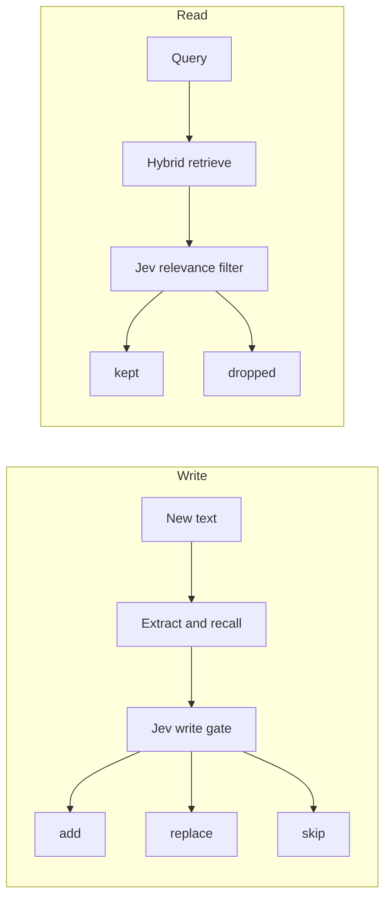

# atlas-jev

atlas-jev is a local memory store. You give it text. An OpenRouter chat model extracts memories worth keeping, and those memories are stored on disk in LanceDB. You can search them later.

Jev is TypeSafe's judgment model. It does not write the memories. It answers the questions that decide what happens to them.

On write, Jev scores whether a candidate is worth keeping. It chooses among add, extra detail, and skip. It also scores conflict with an existing memory. On read, Jev scores each hit. Hits that would not help answer the query are dropped.



## How ingest works

1. An OpenRouter chat model reads the text and extracts separate memories. Each memory is one statement that can stand on its own, with a type and a confidence score. The types are preference, fact, goal, relationship, decision, plan, constraint, and other. Small talk and passing details are left out.

2. A local embedder turns each candidate into a vector, which is a list of numbers that represent its meaning. Nearby existing memories are then looked up in LanceDB.

3. Jev answers a set of questions about the candidate and those neighbors.
   - Whether this is worth remembering, rather than small talk.
   - Whether the store should add it, keep it as extra detail, or skip it because it is already known.
   - If neighbors exist, which one this refers to, and whether it contradicts that neighbor.
   - If the conflict score is at least 0.7, whether the store should replace the old memory or keep the old one and drop the candidate.

4. The pipeline applies that answer.
   - If worth is below 0.5, the candidate is skipped.
   - If the operation is replace and there is a target, that memory is overwritten. The old value is kept so you can revert.
   - If the operation is update, the candidate is stored as a new memory. Compatible extra detail does not overwrite the old fact.
   - If the operation is skip or keep, the candidate is skipped.
   - Otherwise the candidate is added.

Every decision is recorded, including skips.

Here is a short example. You add "I currently live in Berlin." That is stored. You add "I moved to Austin last month." Jev treats this as a conflict, so the Austin memory replaces the Berlin one. You add "Just a reminder, I live in Austin now." That restatement is skipped.

## How search works

Search uses LanceDB hybrid retrieval. Memories are looked up by meaning (the vector) and by words (full text), then ranked together.

Jev then scores each hit. A hit stays if the relevance score is at least 0.5. Sharing a word or a nearby topic is not enough. The memory has to be about the same subject the query is asking about.

If you search "Where do I live?", the Austin memory is kept. If you search "What is the capital of France?", the relevance filter drops the location memory.

## Install

You need Python 3.11 or newer and [uv](https://docs.astral.sh/uv/).

```bash
uv sync
cp .env.example .env
```

Set `OPENROUTER_API_KEY` in `.env`. That key must be able to call both the extraction model and `typesafe/jev-1.13` on OpenRouter.

The first run downloads the local embedding model (`BAAI/bge-small-en-v1.5`). Memories are stored under `.atlas_jev/lancedb` by default.

## Command line

```bash
uv run atlas-jev add "I currently live in Berlin. That's been home for a few years."
uv run atlas-jev add "I moved to Austin last month. I don't live in Berlin anymore."
uv run atlas-jev add "My dog is named Pixel."
uv run atlas-jev search "Where do I live?"
uv run atlas-jev list
uv run atlas-jev history
uv run atlas-jev history 3f2a9c
uv run atlas-jev revert 3f2a9c
```

`add` runs extraction and the write gate, then writes the memories the gate keeps. `search` retrieves candidates, then keeps the ones Jev scores as relevant. `list` shows the current store. `history` shows gate decisions and writes. `revert` restores a memory's previous value. You can pass a unique id prefix instead of the full id.

## Python

```python
from atlas_jev import MemoryPipeline

pipeline = MemoryPipeline()
pipeline.add("I currently live in Berlin.")
hits = pipeline.search("Where do I live?")
for hit in hits:
    print(hit.memory.text, hit.relevance)
```

## Settings

These are read from the environment or from a `.env` file.

| Variable | Default | What it does |
| --- | --- | --- |
| `OPENROUTER_API_KEY` | (required) | OpenRouter key for extraction and for Jev |
| `OPENROUTER_MODEL` | `openai/gpt-4o-mini` | Chat model that extracts memories |
| `JEV_MODEL` | `typesafe/jev-1.13` | Jev model on the OpenRouter Decisions API |
| `ATLAS_JEV_DB` | `.atlas_jev/lancedb` | LanceDB directory |
| `ATLAS_JEV_EMBED_MODEL` | `BAAI/bge-small-en-v1.5` | Local embedding model |
| `ATLAS_JEV_RECALL_LIMIT` | `3` | How many nearby memories to show Jev on write |
| `ATLAS_JEV_RECALL_DISTANCE` | `0.85` | Max vector distance for a neighbor to count |
| `ATLAS_JEV_WORTH_THRESHOLD` | `0.5` | Skip candidates below this worth score |
| `ATLAS_JEV_CONFLICT_THRESHOLD` | `0.7` | Treat a neighbor as a conflict at or above this score |
| `ATLAS_JEV_RELEVANCE_THRESHOLD` | `0.5` | Drop search hits below this relevance score |

## Tests

The unit tests cover store revert and the rule that a compatible update is stored as a new memory. They do not call OpenRouter.

```bash
uv run python -m unittest discover -s tests
```

`test.py` is a live script that runs the same flow against OpenRouter and Jev. It needs a key and it writes to the configured database.

## Layout

```
src/atlas_jev/
  llm.py         extraction through OpenRouter
  embeddings.py  local vectors
  store.py       LanceDB tables, hybrid search, versions
  jev.py         OpenRouter Decisions API client
  gate.py        Jev questions for write and read
  pipeline.py    ingest, search, history, revert
  cli.py         atlas-jev command
```
